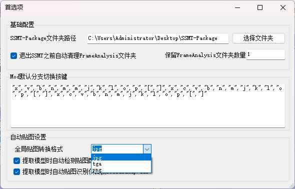
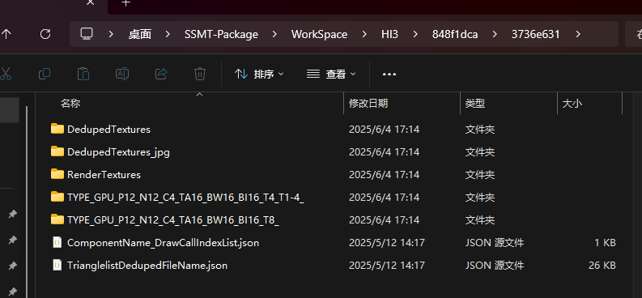
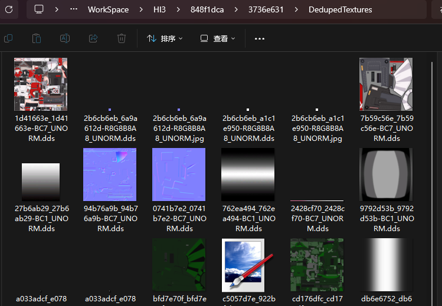
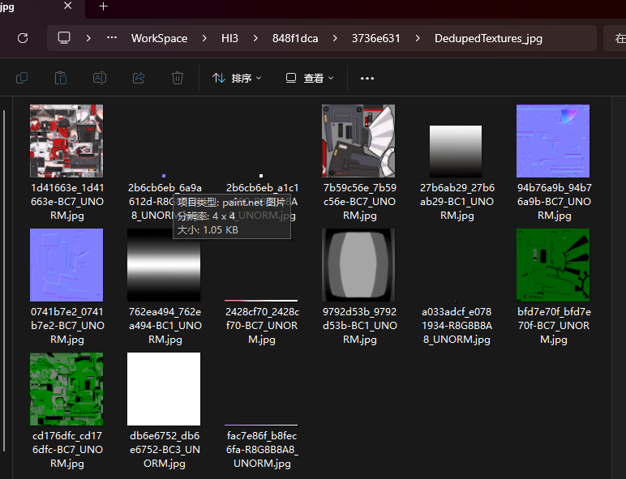
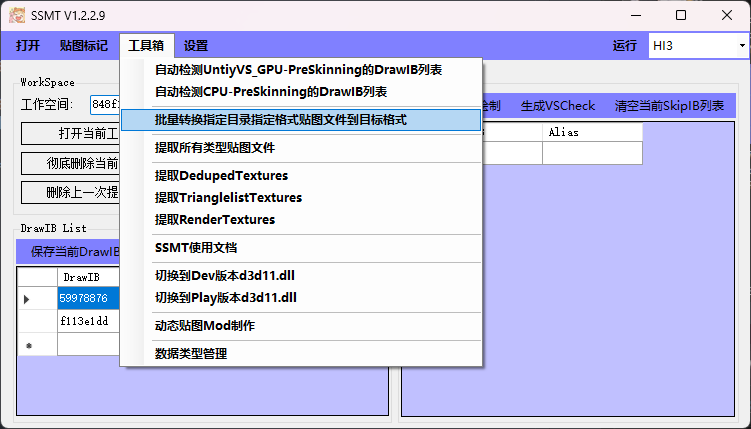
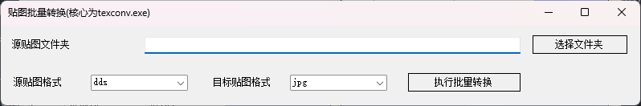

# 贴图格式转换

SSMT天然集成了贴图格式转换功能，利用Plugins目录下的texconv.exe，可以轻松地把dump下来的dds文件转换为我们使用所需要的格式。

因为SSMT的设计思想是尽可能的简化制作Mod的流程，所以才有了贴图转换的集成。

## (1) 全局贴图转换格式

设置中可以指定【全局贴图转换格式】，当我们点击【提取模型】后，提取出来的DedupedTextures会被转换为对应格式，如下图：

我们可以看到提取出来的DedupedTextures里面所有的dds格式贴图都被转换成了我们设置好的【全局贴图转换格式】放到了DedupedTextures_jpg中。

这里转换出来的文件夹名称以_jpg结尾是因为我们选的格式是jpg，如果选的格式是png则生成的文件夹就是DedupedTextures_png了。

这个转换出来的_jpg文件夹，是用于支持我们的【贴图标记】页面功能的使用的。

同时也方便我们手动上贴图的时候使用。

特别是部分有模型处理需求的人，一般会选择tga格式，然后在Blender里贴好所有贴图，这里不细说了，如果你用到了自然懂，用不到也不需要知道。

总之，有了贴图转换的集成，可以节省很多手动转换的时间。

## (2) 批量转换指定目录指定格式贴图文件到目标格式

这个功能实际上就是对texconv.exe做了一个简单的图形化界面包装。

比如这里我们可以选择源贴图格式和目标贴图格式，以及要转换的贴图所在的文件夹。

然后我们点击执行批量转换，就会递归的进行格式转换，但是这里仍然有一些问题需要注意。

一般我们使用这个功能，只是把dds格式转换为png或者jpg格式方便手动上贴图，不建议把png或者jpg批量转换为dds，因为可能会丢失通道信息，dds格式也分很多种，所以不建议这么用它。

