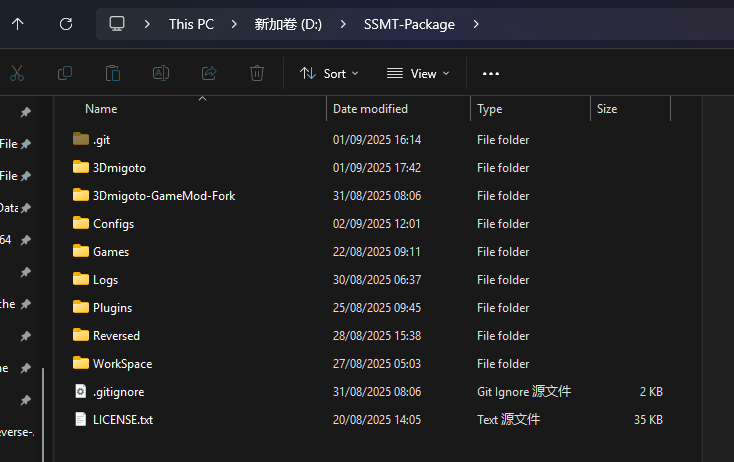
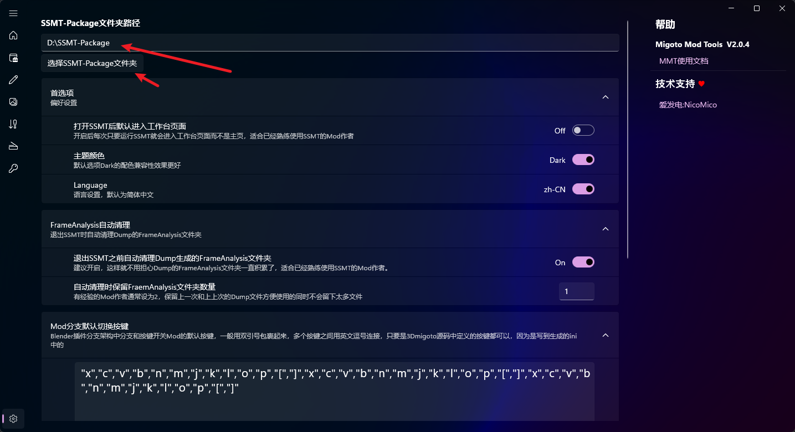
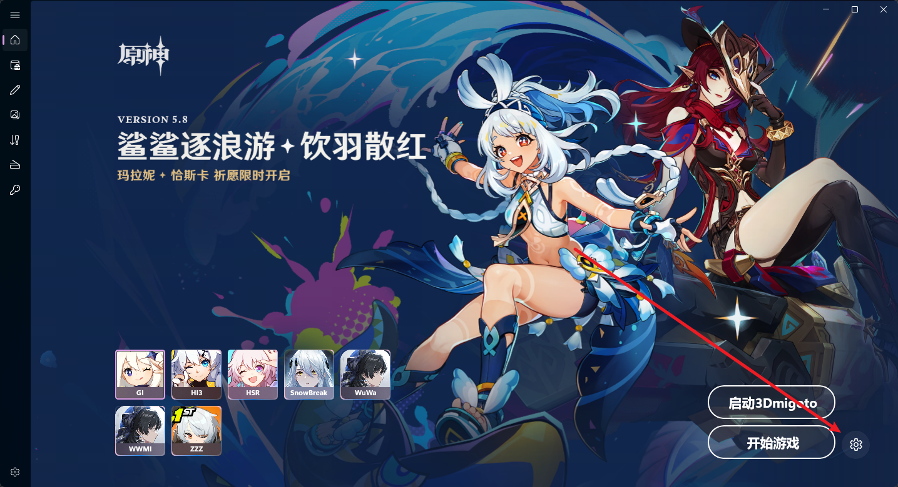
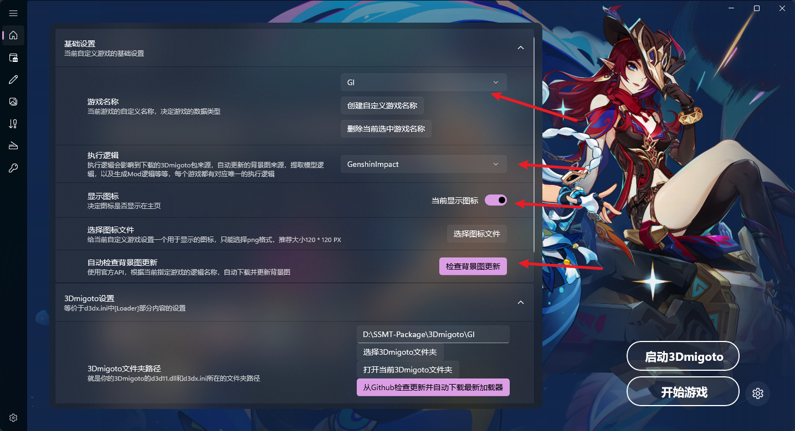
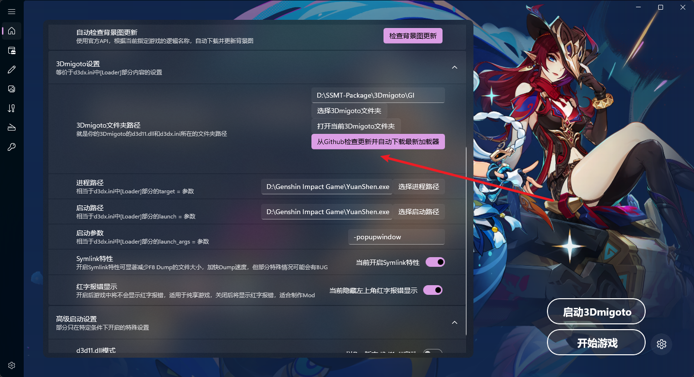
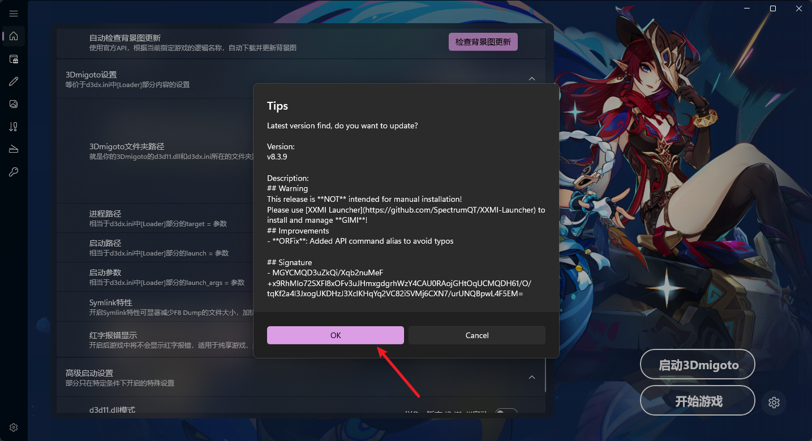
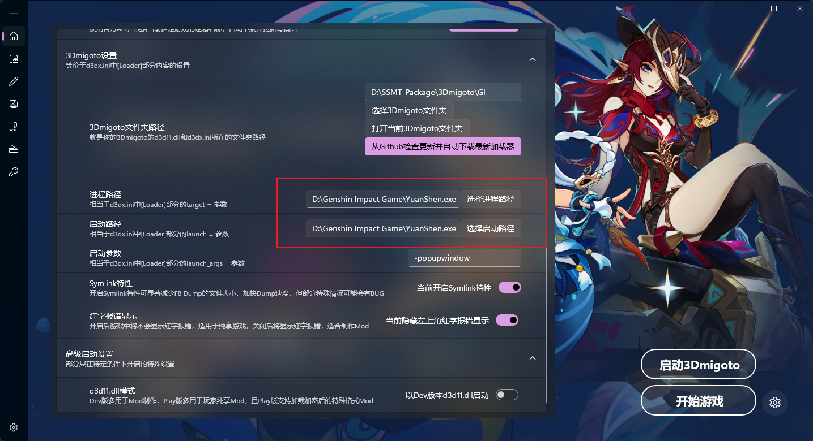

# 以原神的配置举例，MMT对所有游戏的使用流程都是相似的。

## (1)下载并解压SSMT-Package到除C盘外的其它磁盘的根目录

## (2)MMT中点击设置页面，将SSMT-Package设为刚才解压出来的文件夹路径

## (3)主页中点击右下角设置按钮

如下图，依次进行操作，游戏名称选择GI，执行逻辑选GenshinImpact，
点击显示图标让图标在主页显示出来，点击检查背景图更新来自动设置背景图

操作完成后即可得到如下界面：

## (4)继续设置3Dmigoto相关

点击【从Github检查更新并自动下载最新加载器】，此步骤需要能够流畅联通Github，有条件可以挂个梯子。

弹出来的提示选OK即可开始自动更新：

最后进程路径和启动路径都填YuanShen.exe所在路径即可：

