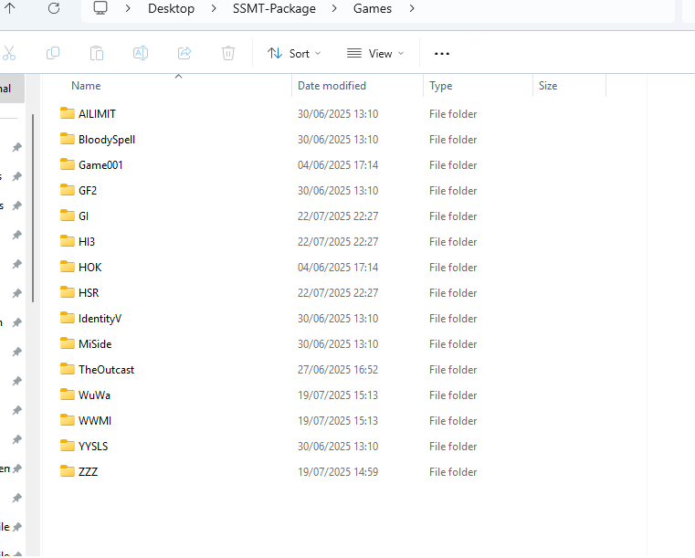
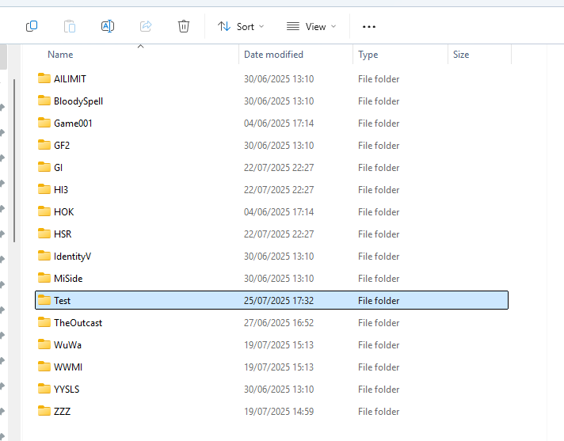
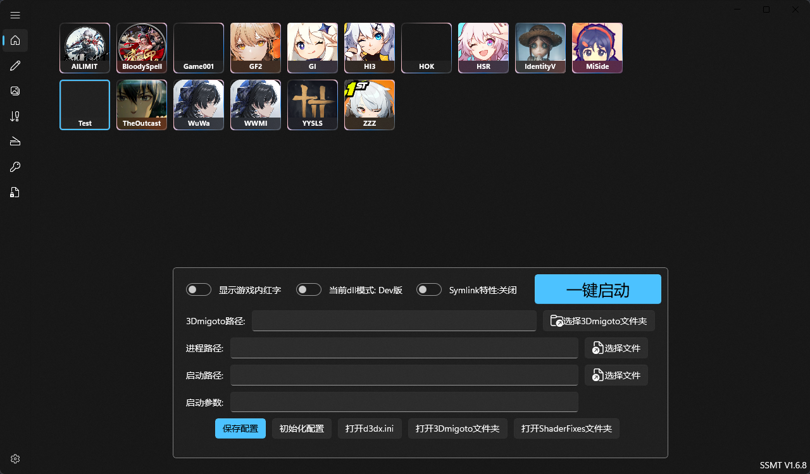

## 假如我想测试其它游戏，我不想使用散装3Dmigoto，SSMT很方便，如何能够使用SSMT的主页来管理参数什么的？

打开你的SSMT-Package文件夹，找到Games文件夹：

你可以新建一个文件夹，随便取个简短的名字，比如Test：

然后我们重启SSMT，就会发现多了一个Test

这里你可以点击【选择3Dmigoto路径】然后选择你这个游戏的3Dmigoto的路径

即可使用SSMT的主页功能管理散装的3Dmigoto。
