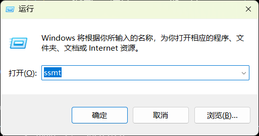
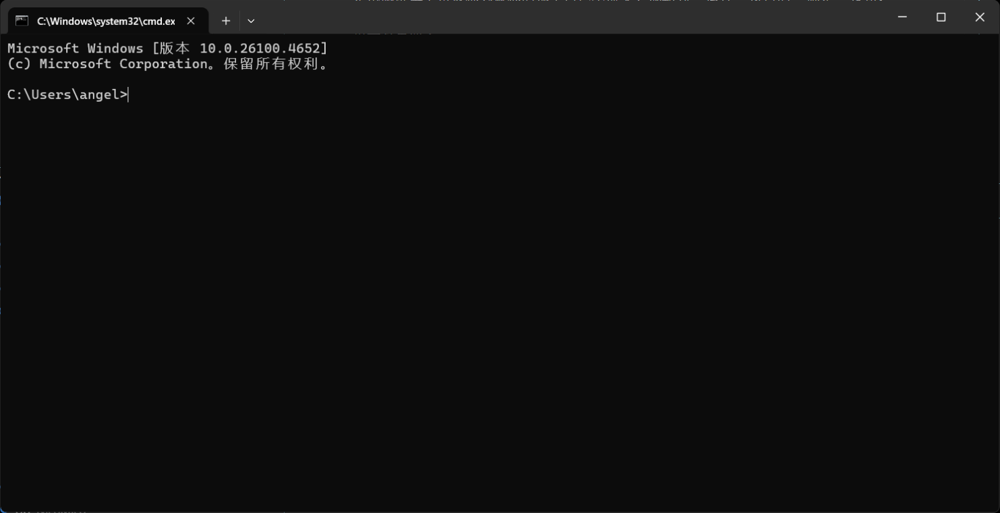

# 一句话总结

```bash
# Only cmd. Unworkable in PowerShell.
# ...\d3dxSkinManager is not essential.
mklink /j "X:\path\to\SSMT-Package\3dmigoto\<game>\Mods\d3dxSkinManager" "X:\path\to\d3dx\home\<game>\work\Mods"
```

# 小白看这里

在实践中遇到了前置知识极其薄弱的朋友为此事反复询问，故下文面向几乎完全的小白。

键盘左下角有一个印有形似 “田” 字的键，叫做 *Windows 徽标键*，简称 win 键。为了打开命令提示符窗口，我们需要按下 win 键，并保持按住，然后按一下键盘上主键盘区的字母键 R 键，然后松开两个键。上述操作被称为 *按下组合键 `Win + R`*，功能是打开一个名字就叫 “打开” 或者叫 “运行” 的窗口。



在 “运行” 窗口中，我们需要输入 `cmd` 三个字母，然后挪动鼠标，操纵光标（也就是电脑屏幕上常被称为鼠标的那个白色小箭头）挪动到 “运行” 窗口的 “确定” 按钮，按一下鼠标左键，点击该按钮。此时会出现一个黑色的窗口，这个就是我们的 cmd 命令提示符界面了。



然后用你知道的任何方式获取 SSMT 的 Mods 文件夹所在路径，得到形如

`X:\path\to\SSMT-package\3dmigoto\<game>\mods`
 
的一串字符串，这里的 `<game>` 是你预期游戏的名字，这里以我们的原神，即 `GI` 为例，**在我自己的电脑上**，上述字符串会是 

`C:\Users\angel\AppData\Local\SSMT\ssmt-package\3Dmigoto\GI\Mods`

然后用你知道的任何方式获取 d3dxskinmanager 的 Mods 文件夹所在路径，得到形如

`X:\to\path\d3dx\home\<username>\work\Mods`

的遗传字符串，这里的 `<username>` 是你自己起的名字，我起了个 `用户名称`，**我自己的电脑上**，上述字符串会是：

`C:\Users\angel\Desktop\d3dx\home\用户名称\work\Mods`

得到两处路径字符串，我们在 cmd 中输入如下文本：

```bash
mklink /j "X:\path\to\SSMT-Package\3dmigoto\<game>\Mods\d3dxSkinManager" "X:\path\to\d3dx\home\<game>\work\Mods"
```

**在我自己的电脑上**，我应该输入的是：

```bash
mklink /j "C:\Users\angel\AppData\Local\SSMT\ssmt-package\3Dmigoto\GI\Mods\d3dxSkinManager" "C:\Users\angel\Desktop\d3dx\home\用户名称\work\Mods" 
```

然后回车即可。这样，我们将会建立一个软链接，让 SSMT 能够加载由 d3dx 生成的 Mod 工作目录。

注意，这里我们将 d3dx 的工作目录链接到 SSMT Mods 目录的一个子目录 `Mods\d3dxSkinManager`，这并不必须，主要是考虑到可能会有其他来源的 Mod 需要一并加载而不由 d3dx 管理。如果并无这种需求，也可以**在备份必要内容后**删去 SSMT 下的这个 Mods 路径，直接把 d3dx 链接到这里的 Mods：

```bash
mklink /j "C:\Users\angel\AppData\Local\SSMT\ssmt-package\3Dmigoto\GI\Mods" "C:\Users\angel\Desktop\d3dx\home\用户名称\work\Mods" 
```

## 还是不会怎么办？

去问 deepseek/ChatGPT/Gimini/Claude/Grok。