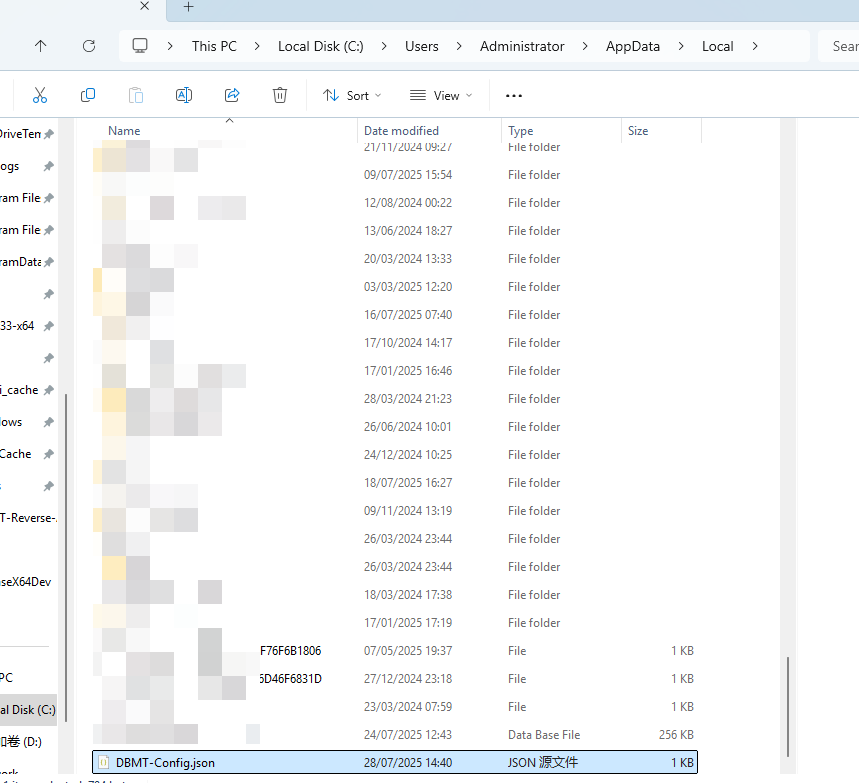

## SSMT无法打开

一般情况下，如果SSMT使用过程中，突然发生以下状况可能会导致无法启动SSMT并且会闪退：

- 电脑蓝屏死机
- 电脑意外强制关机，比如断电

## 如何恢复

打开你当前用户的AppData的Local目录：

例如我的是这个

C:\Users\Administrator\AppData\Local

可以看到一个DBMT-Config.json

把这个文件删掉

然后删除你的SSMT-Package

重新打开SSMT即可正常使用。