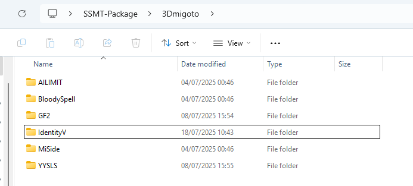
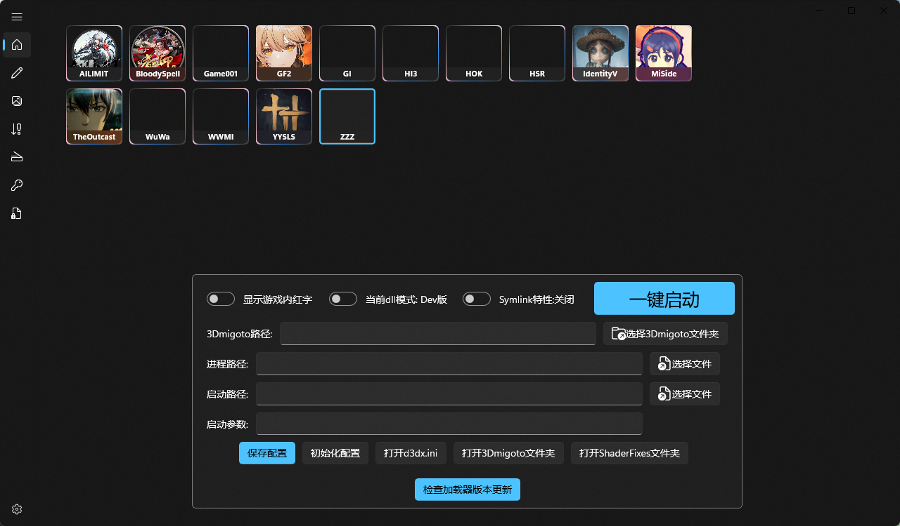
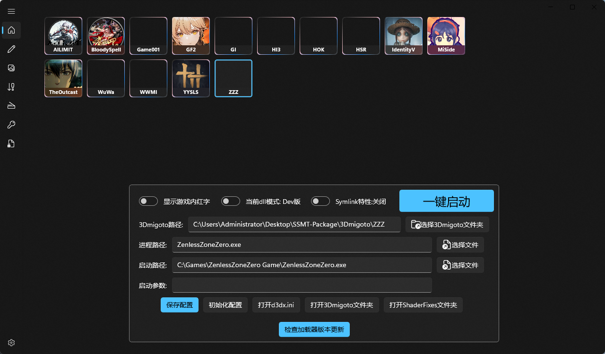

# 检查加载器版本更新

在我们下载了SSMT-Package之后，会发现部分游戏不会默认附带加载器的：

可以看到SSMT-Package的3Dmigoto目录下，常用游戏GI,HSR,ZZZ,HI3的加载器都不存在了。

这是因为这些游戏的加载器由AGMG社区负责维护，且更新特别频繁，如果我们手动搬运到SSMT-Package中

如果手动搬运不能第一时间搬运，就会导致内容落后。

所以现在我们有了全自动检查更新并下载功能。

# 主页按钮
以ZZZ为例，我们切换到ZZZ，发现是没有加载器的，所有内容都是空的。

此时确保你的电脑能联通Github，如果不行可以加魔法，然后点击【检查加载器版本更新】按钮：

可以看到会弹出一个最新版本的描述，并且让你确认是否安装，如果你点OK的话，按钮右侧就会开始转圈圈自动安装。

安装完成后就会自动设置好当前游戏的加载器各个配置：

此时我们就全自动更新好加载器了，就可以进行后续的步骤了。

# 注意

- 使用此自动更新功能时，确保先关闭游戏，防止3Dmigoto文件被进程占用导致无法更新。
- 使用此自动更新功能时，确保网络畅通能改连接到Github。
- 在没有这个功能之前，有一段时间我们是不得不使用XXMI Launcher来负责加载器的更新的，现在可以不用那样做了。

此功能和用法仍在不断改进中，如有改进建议请向我提交，谢谢。

