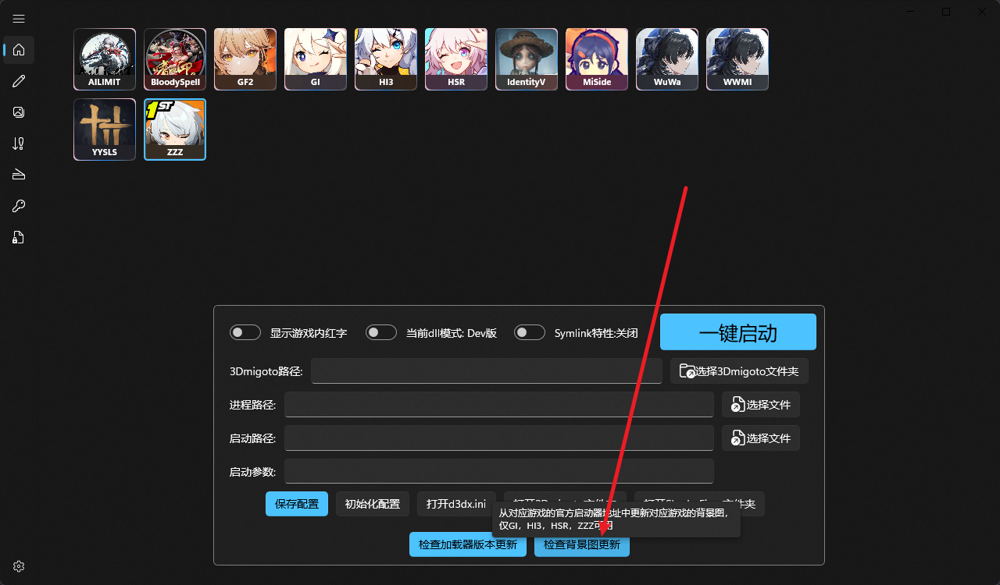
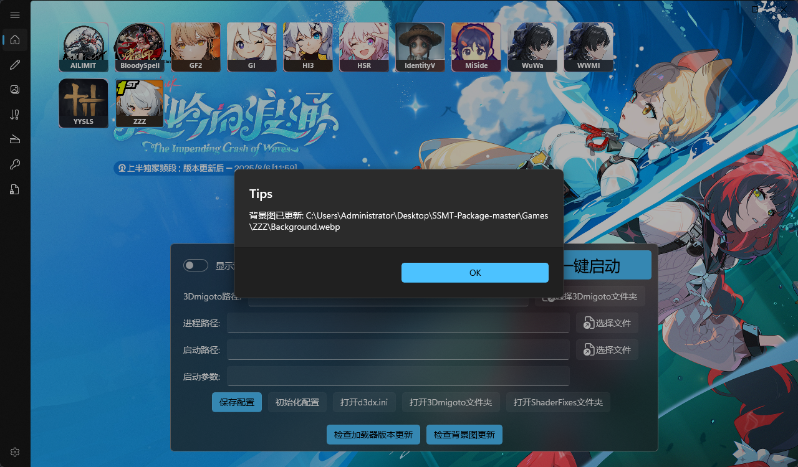
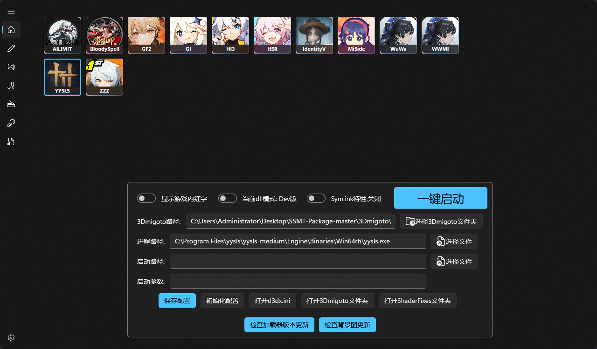
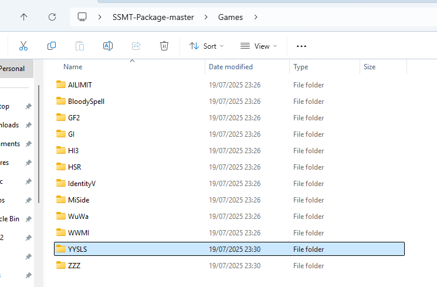
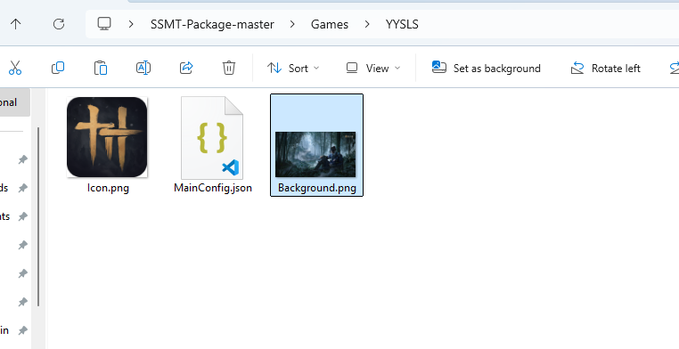
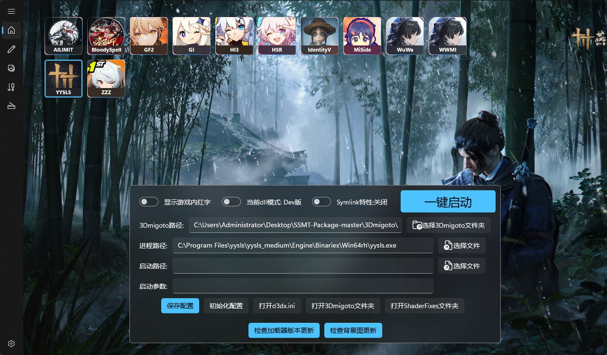

# 背景图设置方法
在我们设置完成SSMT-Package路径后，切换到主页就会出现如下界面：

可以看到所有的游戏都没有背景图，此时如果是米游（GI,HI3,HSR,ZZZ），则可以点击【检查背景图更新】

可以看到随后背景图就自动联网更新好了：

但是这个联网更新只支持一部分游戏，剩下的那些游戏怎么办？

比如这里我们随便选中一个游戏YYSLS：

随后我们打开SSMT-Package，进入下面的Games文件夹，可以看到有一个文件夹叫YYSLS：

进入其中，从其他地方复制过了一个.png格式的图片，改名为Background.png：

随后重启SSMT，背景图就设置好了：

其它游戏也可以这么设置，目前仅支持png格式，后续如果有特殊需求再添加其他格式支持。

