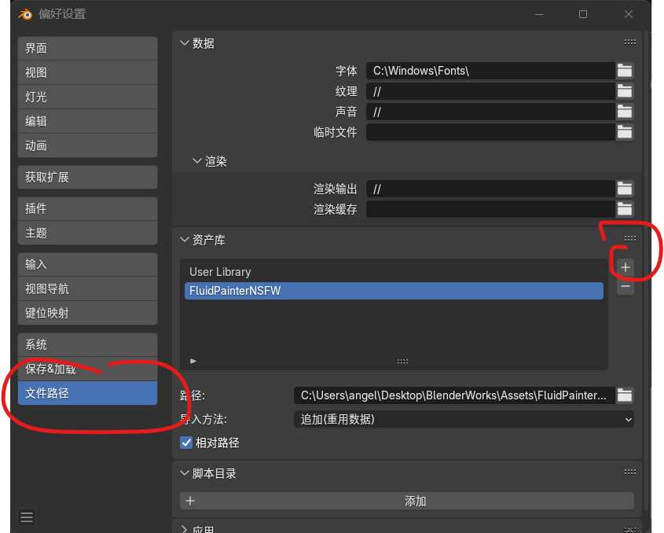

# Fluid Painter NSFW
下载地址：

https://smutba.se/project/91fca296-c230-459e-b745-00ae0fed1684/

# 安装

这是一个资产库，安装与插件不同，须要打开 `编辑`→`偏好设置`→`文件路径`→`资产库`，点击右侧的 `+`，然后选择该资产库的 `.zip` 文件即可。

# 使用

1. 拖出一个 `资产浏览器` 窗口，物体模式下，将希望使用的笔刷拖动到希望作用到的物体表面；
2. 在 `属性` 窗口切至修改器分页，将 `Fluid Drawing Object+` 设定为目标物体；
3. 编辑模式下，在左侧工具栏选择 `自由线` 工具；
4. 开始绘制。

# 用途

如你所见。