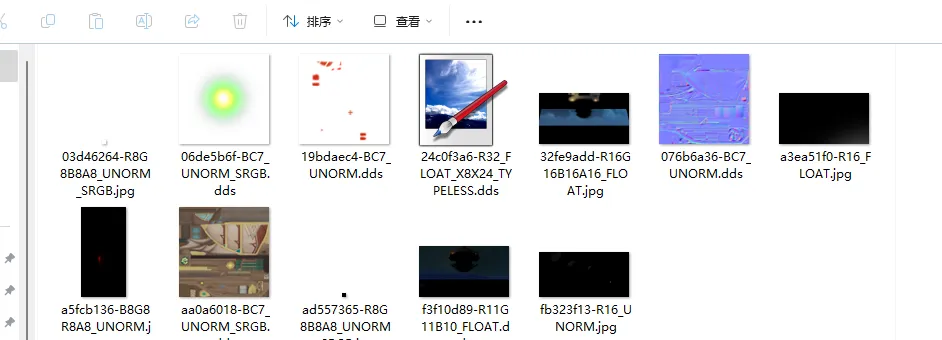

# Paint.net

在制作Mod的过程中，非常常用的一款工具是paint.net

下载地址：

https://github.com/paintdotnet/release/releases

# 用途

- 提供dds贴图预览图，有了这个就能在文件夹中预览dds格式贴图了

- 快速修改并游戏内F10刷新查看效果，很方便测试使用。
- 快速修改dds贴图的格式

# 缺点

- 原版Paint.net无法按通道修改贴图内容，不如Photoshop好用
