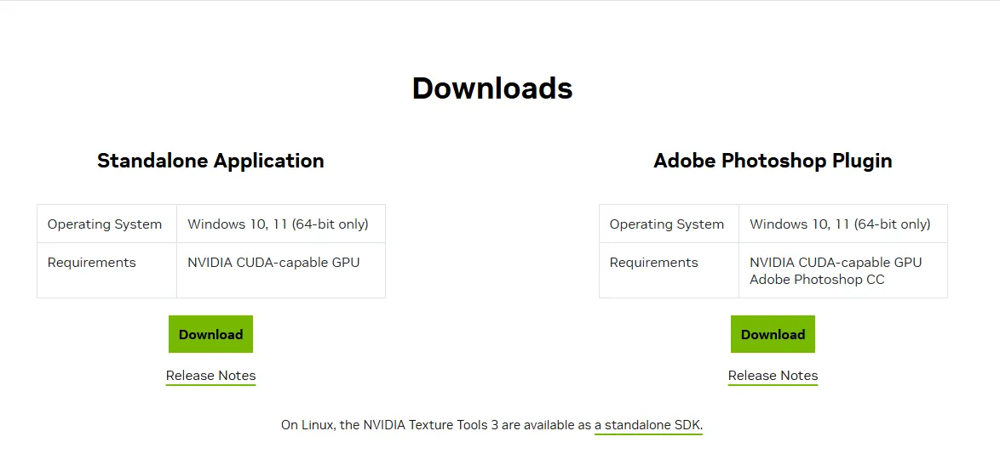
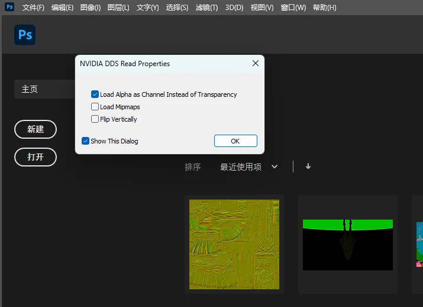

# Photoshop

PS就是PhotoShop，这个你自己下载一个版本就好了，推荐2021及以上的版本

https://www.adobe.com/hk_en/products/photoshop.html

# NVDIA Texture Tools Plugin
NVDIA Texture Tool 分为独立程序和PS的插件两个部分

下载官网：https://developer.nvidia.com/texture-tools-exporter

只有这个才能真正决定dds插件的精准格式，结合paint.net使用可以覆盖3Dmigoto所有贴图应用场景。

这里我们不推荐使用单独的程序，而是推荐使用右边的Adobe Photoshop Plugin
安装也很简单，只要你的电脑上安装好了PS，直接运行Adobe Photoshop Plugin的安装包一路下一步就安装好了。

这里要注意一个细节：

安装这个插件后，在打开dds文件时会弹出一个对话框指定加载选项。

- Load Alpha as Channel Instead of Transparency
这个选项顾名思义，Alpha加载为单独的通道而不是透明度，这个非常重要，因为除了基础色之外大部分dds贴图都有4个通道，而部分游戏的基础色贴图也使用Alpha通道绘制灰度值来控制游戏内部件渲染的透明度，所以这个必须勾选。

- Load Mipmaps
Mipmap顾名思义，一般情况不需要加载，只有部分特殊情况，比如UE引擎可能会使用到

- Flip Vertically
3Dmigoto导出的所有贴图以及对应的UV都是上下相反，左右再相反的，这里千万不要勾选。

- Show This Dialog
这个必须勾选，不然以后打开dds贴图就不显示这个对话框了，不勾选的话后面制作贴图时会很难受，会把Alpha加载为透明而不是通道，导致无法修改alpha通道的内容，导致无法制作mod。

# Intel Texture Works Plugin

部分用户反馈 NVDIA的dds插件不太好用，Ps的Intel dds插件更好用

的确，PS默认保存DDS格式的贴图时，总是保存为固定的BC7_SRGB或BC7_UNORM，导致我们仍然需要在Paint.net中再次转换格式。

https://www.intel.com/content/www/us/en/developer/articles/tool/intel-texture-works-plugin.html
