# Vertex Color Master

项目地址

https://github.com/andyp123/blender_vertex_color_master

Vertex Color Master插件，简称VCM插件。

# 用途
- 解决3Dmigoto Mod制作中精细刷COLOR值的问题。
- 刷COLOR值的标准工具只推荐VCM插件，其它方法都是偷懒不推荐

# 快速设置轮廓线粗细
在部分游戏比如GI中，COLOR的RGBA分量中的Alpha分量，是控制轮廓线粗细的。

在远古时期，人们喜欢使用GIMI的快速轮廓线设置脚本来快速设置轮廓线粗细：

https://github.com/SilentNightSound/GI-Model-Importer/blob/main/Tools/genshin_set_outlines.py

以及快速COLOR设置脚本来设置COLOR的四个分量：

https://github.com/SilentNightSound/GI-Model-Importer/blob/main/Tools/genshin_set_color.py

但是这种方法有如下缺点：
- 学习成本高，额外学习并记忆一个工具的使用。
- 不通用，只有GI的部分数据类型可以使用。
- 黑框框脚本很难用。
- 在HSR，ZZZ，WuWa等需要精确控制COLOR内容的游戏中，无法达到正确效果，例如部分Shader需要读取正确的COLOR值才能显示模型，如果不刷对COLOR值，就会导致做好的Mod不显示的问题。

最标准的做法是使用VCM插件，以快速设置轮廓线粗细举例：
1.切换到顶点绘制：

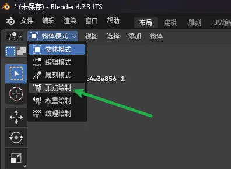

2.打开VCM插件右侧面板

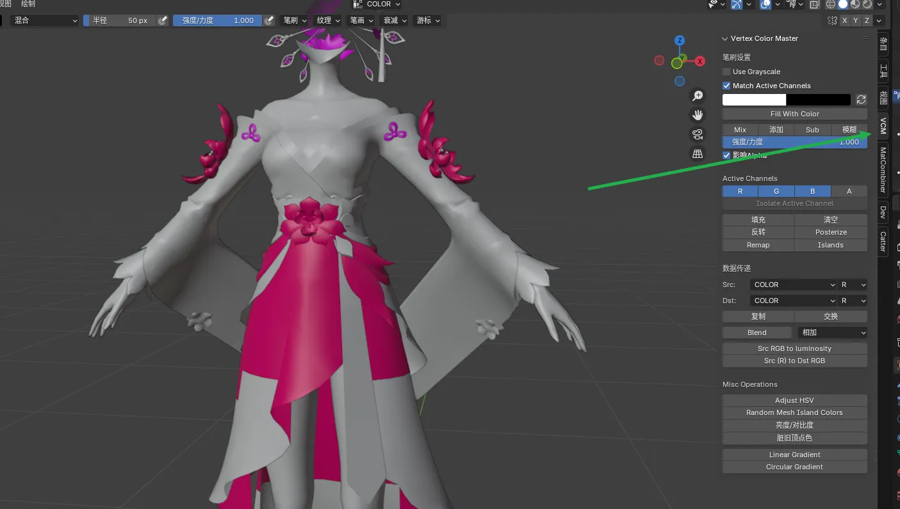

3.因为我们要设置COLOR的A分量，所以这里选择A：

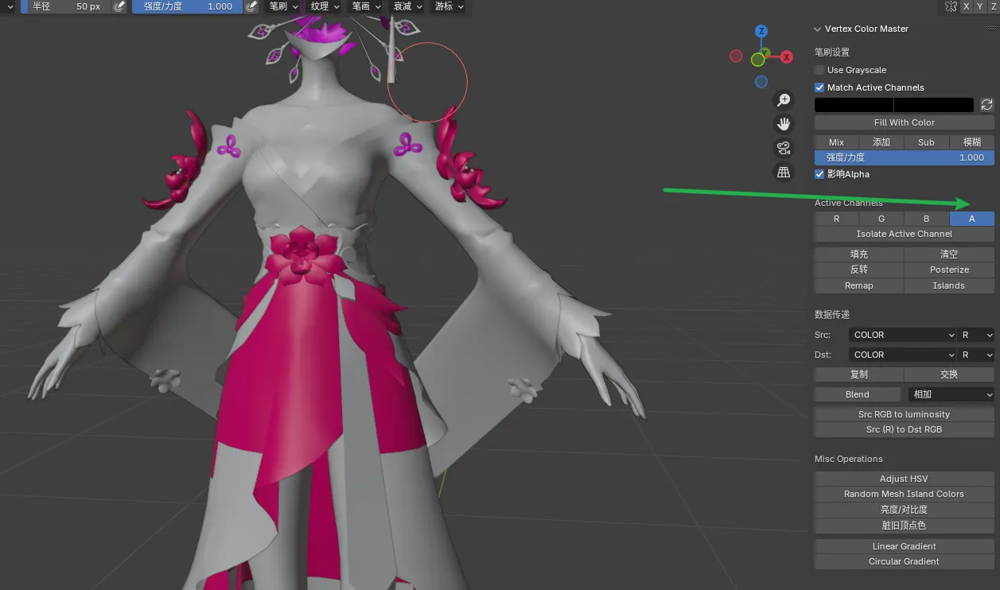

4.随后点击Isolate Active Channel

被选中的A就是A通道 (A Channel)，Isolate就是隔离的意思，Active指被选中的就是被激活的。

点击后进入A通道的视图中：

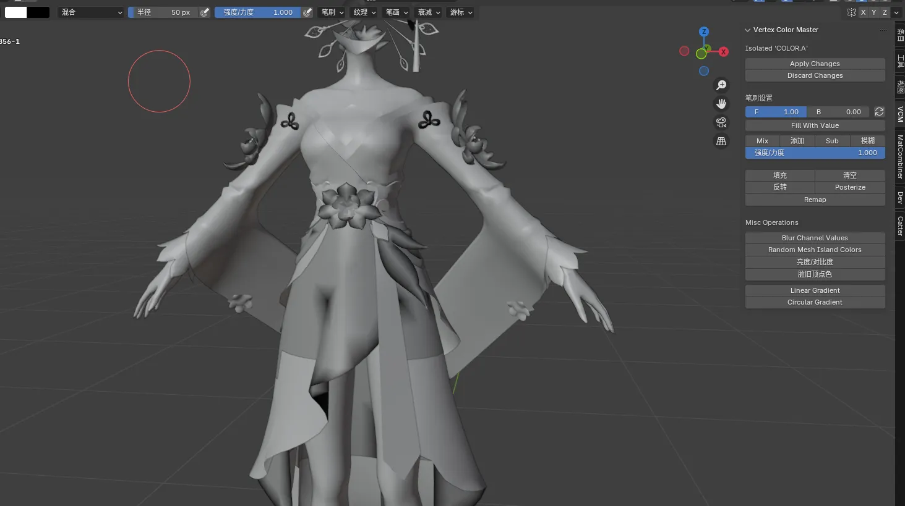

5.选择具体的RGB值，可以看到这里能够非常精细地控制这个通道要刷的具体颜色。

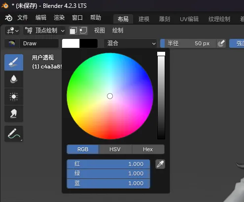

一般单个通道中，只刷黑到白的颜色，所以我们在滑条上拖动：

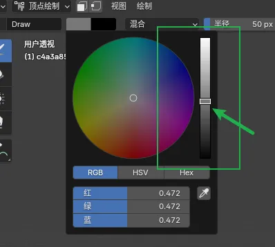

你要设置的轮廓线粗细，就是这个滑条的值，也就是RGB的统一值，对于GI这个游戏来说，0就是没有轮廓线，1就是轮廓线最粗，0.5是默认值。

这里我们随便选择一个值：

然后点击Fill With Value，可以看到整个A通道所有内容都Fill为具体某个值了：

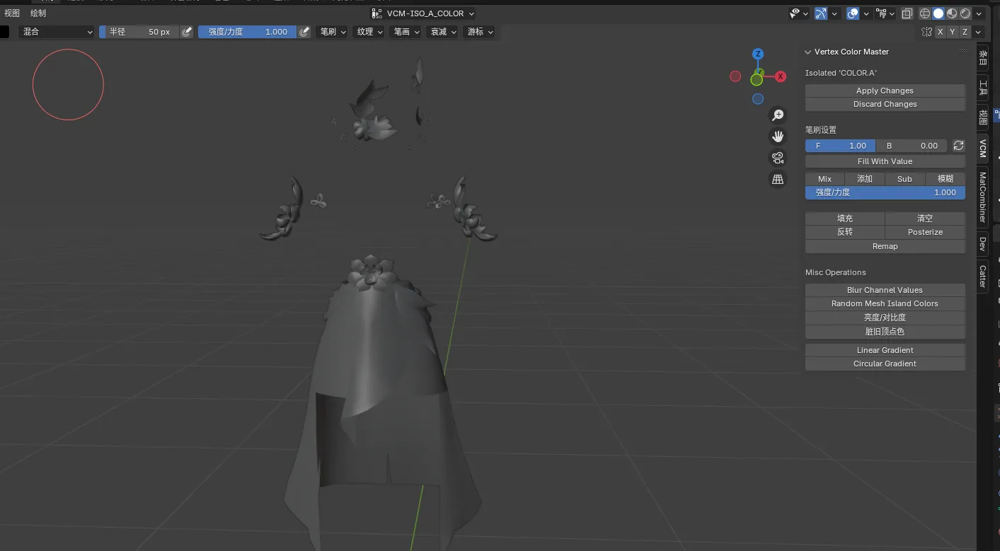

这里你看到颜色不一致，是因为我们选择的视图着色方式错误，在刷COLOR值时，一定要将光照设置为平面，否则还会导致吸出来和涂出来不是一个色：

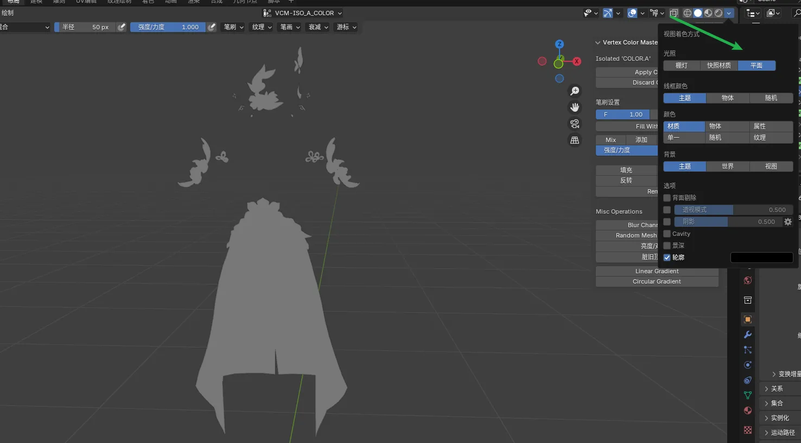

这样才能更好的看清楚效果。

在刷完之后，我们点击Apply Changes：

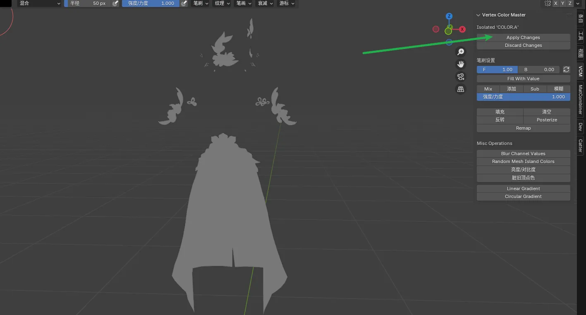

就会应用并返回RGBA四个通道同时显示的界面：

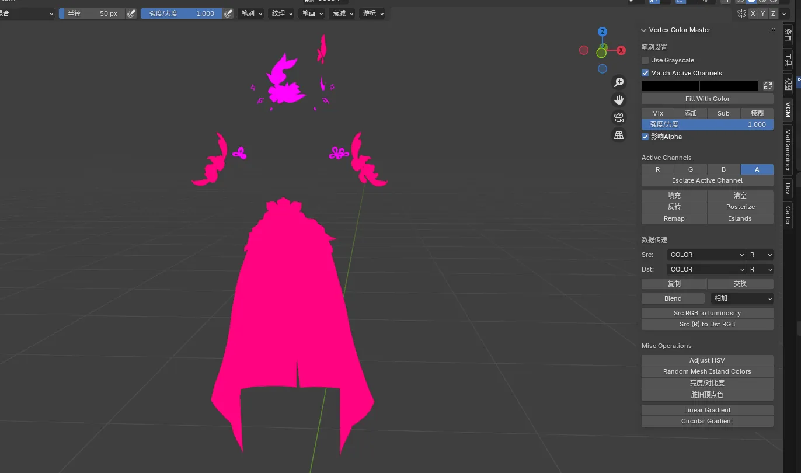

此时我们已经刷完了，返回物体模式即可：

别忘了把视图着色方式改回来：

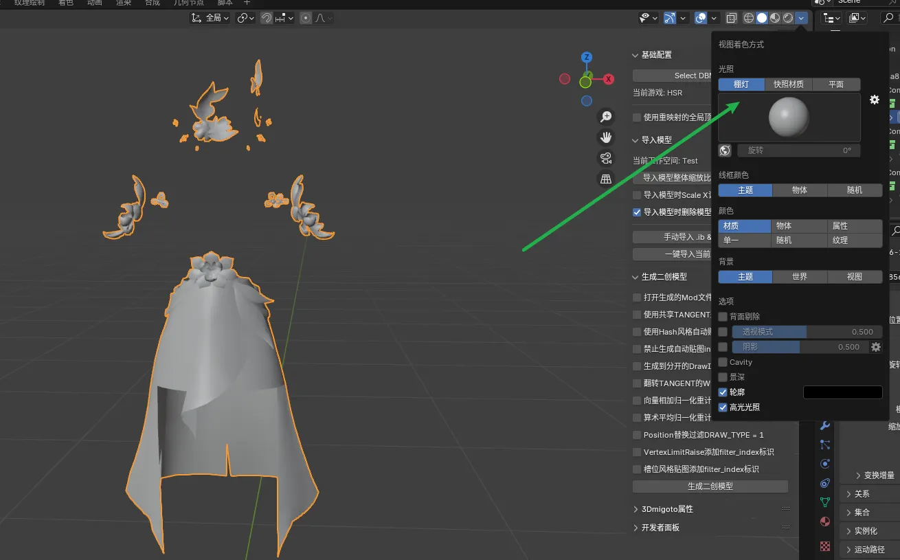

